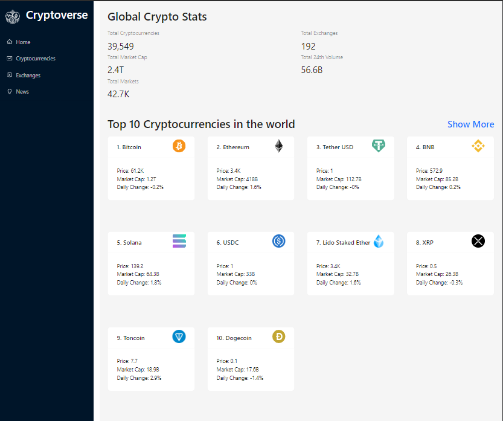
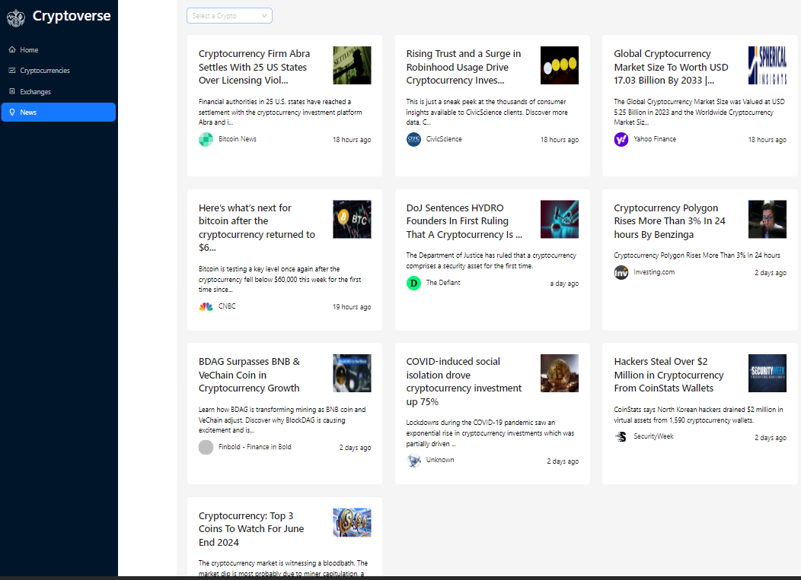
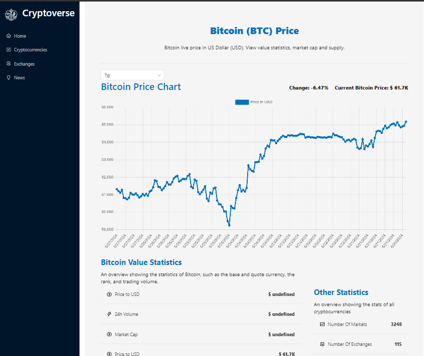
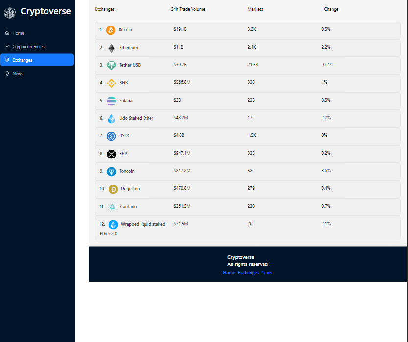

## Links
- [GitHub URL](https://github.com/sukanyagurav/Entertainment-web-app)
- [Live URL ](https://cryptoverse5867.netlify.app/)

## Cryptoverse

In this project-
 - user can view various cryptocurrencies. 
 - user can see the cryptocurrency details with that the chart for the current cryptocurrency.
 - news related to the cryptocurrencies. Added the pagination for various news.
 - User can select the news type and get the news related to that cryptocurrency

## Technologies
- React
- Redux toolkit
- RAPID API
- Ant design for styling 

| Desktop Preview                                                          | Mobile Preview              |
| ----------------------                                                   | ---------------------- |
|  |  |

| Tablet Preview                                                           | New Preview Page           |
| ----------------------                                                   | ---------------------- |
|   |  |

| Coin details Preview page                                                   | Exchange preview page          |
| ----------------------                                                      | ---------------------- |
|   |  |

## Useful resources
 - [JS Mastery](https://youtu.be/9DDX3US3kss?si=AERaWH0IerHmLAjG)
 - [News API](https://news-api14.p.rapidapi.com/v2)
 - [Coin API](https://coinranking1.p.rapidapi.com)

## Available Scripts

In the project directory, you can run:

### `npm start`

Runs the app in the development mode.\
Open [http://localhost:3000](http://localhost:3000) to view it in your browser.

The page will reload when you make changes.\
You may also see any lint errors in the console.

### `npm test`

Launches the test runner in the interactive watch mode.\
See the section about [running tests](https://facebook.github.io/create-react-app/docs/running-tests) for more information.

### `npm run build`

Builds the app for production to the `build` folder.\
It correctly bundles React in production mode and optimizes the build for the best performance.

The build is minified and the filenames include the hashes.\
Your app is ready to be deployed!

See the section about [deployment](https://facebook.github.io/create-react-app/docs/deployment) for more information.

